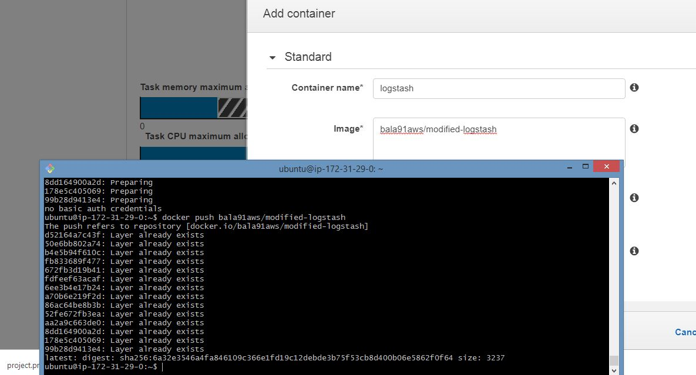

# ElasticSearch

As an engineer, I have implemented this Twitter Analysis using kibana to work on this lab which have used Elasticsearch.

The elastic Family or stack :  Elasticsearch Logstash and Kibana

So ELK provides centralized logging that be useful when attempting to identify problems with servers or applications. It allows you to search all your logs in a single place

# The Implementation of ELK stack – Elasticsearch Logstash Kibana in dockerized containers. 

In this use case, it can be demonstrated that serverless loggings of many microservice dependent, Iot sensors will or in near future that will be designed for edge computing has requirement of this state-of-art standalone product called Elasticsearch Logstash Kibana. 

Not only these IoT devices, ELK can be used for firewall monitoring. Metric beats or File beats are generally used for visualization on these application layers to search, view and interact with data stored. ELK gives high performance and near real time for managing logs from serverless functions.

So in this part I have connected three clusters together for distributed computing, here the elasticity of clusters is taken as advantage. The cluster of nodes are scalable, then data engineered to collect logs, parse them and store them for later use.

It becomes easier to operate the ELK stack for its capability for logging the data into elasticsearch without the requirement of these records undergoing the transformation. This job is done by logstash configuration file.  It consist of input, output and filter plugins. This data pushed to elasticsearch, which is NoSQL built based on apache lucene, a data warehousing solution for ELK. 

The next use case for elasticsearch service is serving as full text search engine, upon the indexed documents. It goes through a process called sharding that represents a unit of document stored for vertical partitioning of functionality, into a separate databases for data re-distribution to prevent overloading. 

Sharding can be done algorithmically or dynamically. In algorithmic sharding, there is a hash function applied to partition key ( portion of primary key which determines how the data is distributed. The key-values based nosql database node undergoes this type of sharding (homogenous) 

Once sharding is done, the redistribution of data is difficult as the shards are atomic units of the partition. HDFS is highly fault-tolerant. It runs a process called name node. Due to dynamic sharding this name node is a single point of failure as there is a need for external locator service. Thus using ELK stack (openwhisk plugin- Logstash) this failure can allow for a practical solution or like an alerting system.

Here the data can be connected through kinesis where the data can be extracted from it to elasticsearch via logstash then visualised using kibana

